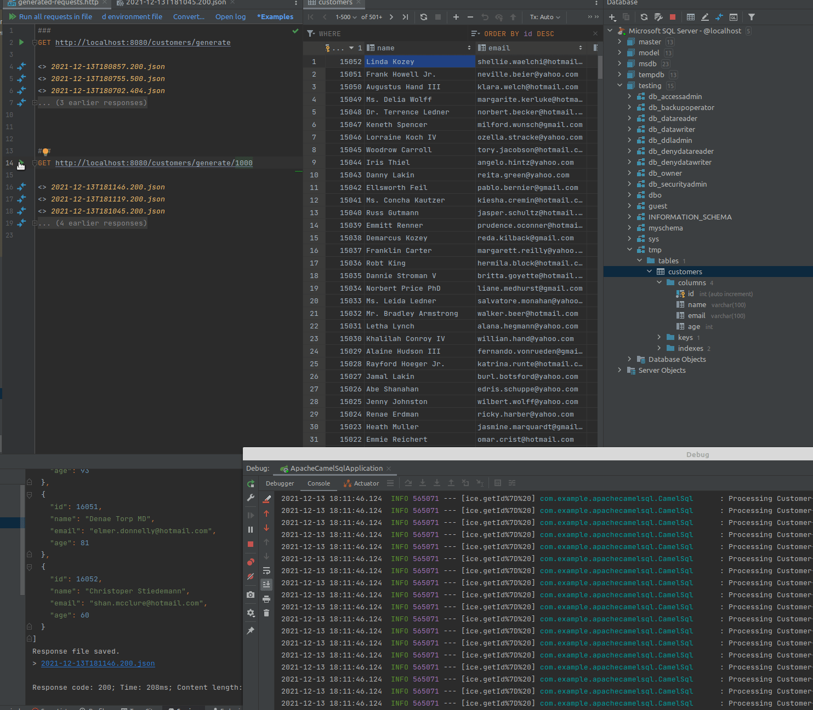

# Apache Camel with SQL component 

Create database `testing` with schema `tmp` and table `customers`


## Generating data

Generate 5 new records
```
GET http://localhost:8080/customers/generate
```

Generate `X` new records (where `X` is number of new records)
```
GET http://localhost:8080/customers/generate/X
```
Example
```
GET http://localhost:8080/customers/generate/100
```




## Start

- start as usual Spring Boot application
- docker with MSSQL is included
- 
```docker
docker-compose up
```